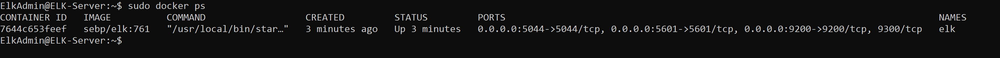
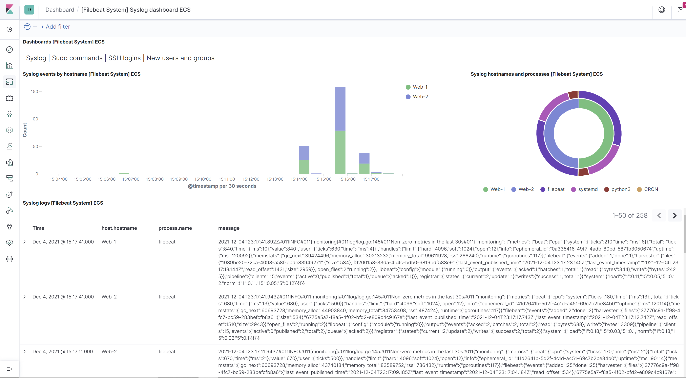
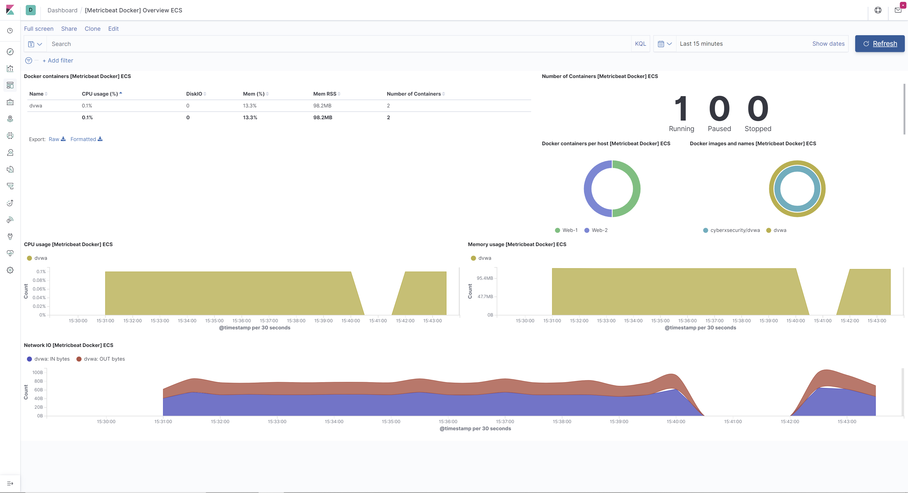

## Automated ELK Stack Deployment

The files in this repository were used to configure the network depicted below.

These files have been tested and used to generate a live ELK deployment on Azure. They can be used to either recreate the entire deployment pictured above. Alternatively, select portions of the _____ file may be used to install only certain pieces of it, such as Filebeat.

  - [pentest.yml](Ansible/pentest.yml)
    - This playbook is used to set up the Web VMs to run DVWA (D*mn Vulnerable Web App). 
  - [install-elk.yml](Ansible/install-elk.yml)
    - This playbook is used to install the ELK Server on the Elk-Server machine.
  - [filebeat-playbook.yml](Ansible/filebeat-playbook.yml)
    - This playbok is used to install and configure Filebeat on the DVWA machines.
  - [metricbeat-playbook.yml](Ansible/metricbeat-playbook.yml)   
    - This playbook is used to install and configure Metricbeat on the DVWA machines. 

This document contains the following details:
- Description of the Topology
- Access Policies
- ELK Configuration
  - Beats in Use
  - Machines Being Monitored
- How to Use the Ansible Build

### Description of the Topology

The main purpose of this network is to expose a load-balanced and monitored instance of DVWA, the D*mn Vulnerable Web Application.

Load balancing ensures that the application will be highly available, in addition to restricting access to the network.
- What aspect of security do load balancers protect? What is the advantage of a jump box?
  -  Load Balancing ensures availability to the servers. In case one out of the two servers we have set up unexpectdly goes down, the load balancer would be able to redirect traffic from the down server to the other available server to ensure availability. 
  -  For this network setup, I used a jump box. The jump box is used to facilitate administrative tasks to the other servers in the network. In this Elk Server set up, the jump box was used to set up the DVWA servers as well as the Elk-Server itself.   

Integrating an ELK server allows users to easily monitor the vulnerable VMs for changes to the files, logs and system metrics.
- What does Filebeat watch for?
  - Filebeat helps generate and organize log files to send to Logstash and Elasticsearch. Filebeat logs informations about the file system, including which files have changed. and when.  
- What does Metricbeat record?
  -  Metricbeat collect metrics from your systems and services.  Metricbeat is a lightweight way to send system and service statistics to Elasticsearch. Logstash, and Kibana.

The configuration details of each machine may be found below.

| Name     | Function | IP Address | Operating System |
|----------|----------|------------|------------------|
| Jump Box | Gateway  | 10.0.0.7   | Linux            |
| Web-1 | Webserver - Runs DVWA from a Docker Container | 10.0.0.7 | Linux |
| Web-2 | Webserver - Runs DVWA from a Docker Container | 10.0.0.9 | Linux |
| Elk-Server |  Server that runs the ELK Stack |  10.1.0.4 | Linux |

### Access Policies

The machines on the internal network are not exposed to the public Internet. 

Only the Jump Box machine can accept connections from the Internet. Access to this machine is only allowed from the following IP addresses:
- Personal/Home IP Address

Machines within the network can only be accessed by SSH.
- The Elk-Server allowed connections TCP connections on port 5601 via my Personal/Home IP Address. It was also allowed SSH access via the Jump Box. 

A summary of the access policies in place can be found in the table below.

| Name     | Publicly Accessible | Allowed IP Addresses |
|----------|---------------------|----------------------|
| Jump Box | No              | Home IP Address via SSH    |
| Web-1    | No. Only accessible via SSH from Jump Box. | 10.0.0.7                     |
| Web-2  | No. Only accessible via SSH from Jump Box   |  10.0.0.7                    |
| Elk-Server  | No. Only accessible via SSH from Jump Box and TCP connections from Personal/Home IP Address on port 5601   |  10.1.0.4                    |

### Elk Configuration

Ansible was used to automate configuration of the ELK machine. No configuration was performed manually, which is advantageous because we are able to make changes to multiple machines simultaneously, and ensure they are configured in the same way. Using Ansible to automate this configuration also means in the future, if we need to add/configure additional servers we have a ready made file that can be ran and a system can be brought up quickly, rather than spending time manually running commands and making configuration changes.

The playbook implements the following tasks:
- Install.io docker and the pip module
- Increase the virtual memory to allow the ELK Stack to run. 
- Download and launch a Docker ELK Container.

The following screenshot displays the result of running `docker ps` after successfully configuring the ELK instance.

### Target Machines & Beats
This ELK server is configured to monitor the following machines:
- Web-1 10.0.0.8
- Web-2 10.0.0.9

We have installed the following Beats on these machines:
- Filebeat
- Metricbeat

These Beats allow us to collect the following information from each machine:
- Filebeat logs informations about the file system, including which files have changed. A sample Filebeat output is shown below. We can see the different logs gnerated by different process running on the system getting picked up by Filebeat. 
  
  
- Metricbeat collects system metrics such as CPU usage, Network IO, and Memory usage. An example output form the ELK Server is shown below. 
  

### Using the Playbook
In order to use the playbook, you will need to have an Ansible control node already configured. Assuming you have such a control node provisioned: 

SSH into the control node and follow the steps below:
- Copy the install-elk.yml file to `/etc/ansible`.
- Update the hosts file in `/etc/ansible` to include an `elk` host group.
- Run the playbook, and navigate to http://[Elk-Server_IP]:5601/app/kibana to check that the installation worked as expected.

_As a **Bonus**, provide the specific commands the user will need to run to download the playbook, update the files, etc._
